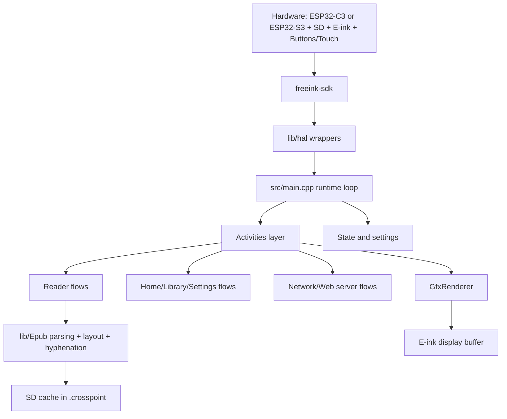
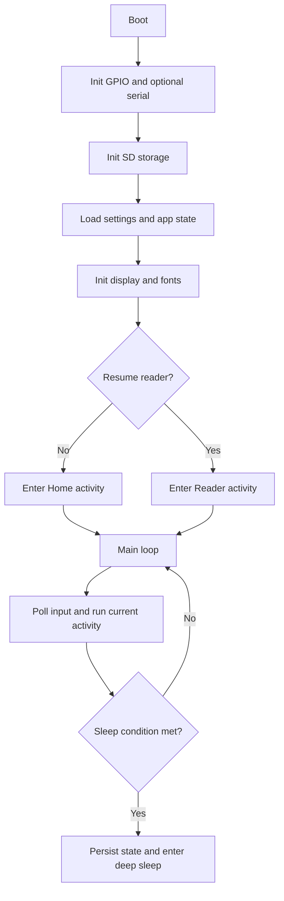
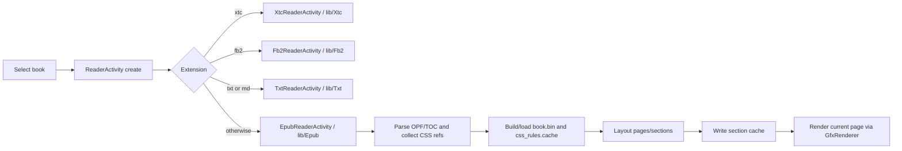
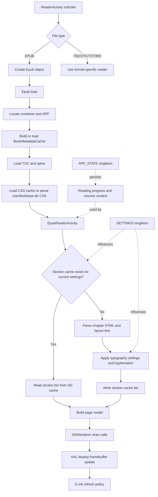

# Architecture Overview

CrossPoint is firmware for the Xteink X4 (unaffiliated with Xteink) and several related e-paper boards, built with PlatformIO. The `default` environment targets the single-core ESP32-C3; the `sticky`, `x4pro`, `x4c` and `papermono` environments target the dual-core ESP32-S3. See [Board targets](#board-targets) below.

At a high level, it is firmware that uses an activity-driven application architecture loop with persistent settings/state, SD-card-first caching, and a rendering pipeline optimized for e-ink constraints.

## System at a glance



## Runtime lifecycle

Primary entry point is `src/main.cpp`.



In each loop iteration, the firmware updates input, runs the active activity, handles auto-sleep/power behavior, and applies a short delay policy to balance responsiveness and power.

## Activity model

Activities are screen-level controllers deriving from `src/activities/Activity.h`.
Nested flows are hosted by `ActivityManager` (`src/activities/ActivityManager.h`), which owns an
activity stack; the former `ActivityWithSubactivity` base class has been removed.

- `onEnter()` and `onExit()` manage setup/teardown
- `loop()` handles per-frame behavior
- `render(RenderLock&&)` draws, on a single shared render task owned by `ActivityManager`
- `skipLoopDelay()` and `preventAutoSleep()` are used by long-running flows (for example web server mode)
- `requiresExclusiveStorageLoop()` suspends navigation while another owner (USB Drive) holds the raw SD card

`ActivityManager::begin()` creates the one render task with `xTaskCreatePinnedToCore()`, on core 1
when `configNUM_CORES > 1` and core 0 otherwise, so long renders stay off core 0's idle watchdog on
the dual-core S3 boards. Navigation goes through `replaceActivity()` / `pushActivity()` /
`popActivity()` and the `goTo...()` wrappers; nested flows use
`startActivityForResult()` / `setResult()` / `finish()` with a typed `ActivityResult`.
For the full task and locking model see [Activity & ActivityManager](../activity-manager.md).

Top-level activity groups:

- `src/activities/home/`: home and library navigation
- `src/activities/reader/`: EPUB/FB2/XTC/TXT/Markdown reading flows
- `src/activities/settings/`: settings menus and configuration
- `src/activities/network/`: Wi-Fi selection, AP/STA mode, file transfer server
- `src/activities/boot_sleep/`: boot and sleep transitions

## Reader and content pipeline

Reader orchestration starts in `src/activities/reader/ReaderActivity.h` and dispatches to format-specific readers.
EPUB processing is implemented in `lib/Epub/`.

`ReaderActivity::create()` picks the concrete reader by file extension, in this order:
`.xtc`/`.xtch`, `.fb2`, then `.txt`/`.md`, with EPUB as the fallback
(`src/activities/reader/ReaderActivity.cpp:32-39`, `lib/FsHelpers/FsHelpers.cpp:178-188`).



Why caching matters:

- RAM is limited (the ESP32-C3 sets the floor at ~380 KB), so expensive parsed/layout data is persisted to SD
- repeat opens/page navigation can reuse cached data instead of full reparsing

## Reader internals call graph

This diagram zooms into the EPUB path to show the main control and data flow from activity entry to on-screen draw.



Notes:

- CSS files are collected from the OPF manifest and, when needed, discovered by
  streaming ZIP paths under the OPF content base directory; the firmware avoids
  preloading the full ZIP central directory for large books.
- "section cache exists" depends on the cache-busting fields in the section header
  (`lib/Epub/Epub/Section.cpp:124-133`): font, line compression, extra paragraph
  spacing, paragraph alignment, viewport width and height, hyphenation, embedded
  CSS, image rendering, and Focus Reading
- rendering favors reusing precomputed layout data to keep page turns responsive on constrained hardware
- progress/session state is persisted so the reader can reopen at the last position after reboot/sleep

### FB2 reading flow

FB2 is a single XML file, so it has no container, OPF or CSS step; everything else mirrors the EPUB
shape.

1. `ReaderActivity::create()` sees the `.fb2` extension and builds an `Fb2ReaderActivity`
   (`src/activities/reader/ReaderActivity.cpp`).
2. `ReaderActivity::onEnter()` calls the virtual `loadBook()`
   (`src/activities/reader/ReaderActivity.cpp:64`); `Fb2ReaderActivity::loadBook()` constructs
   `Fb2(bookPath, "/.crosspoint")` (`src/activities/reader/Fb2ReaderActivity.cpp:31`), which derives
   the cache directory `/.crosspoint/fb2_<hash>` (`lib/Fb2/Fb2.cpp:65`).
3. `Fb2::load()` reads `<cache>/book.bin` if present (`lib/Fb2/Fb2.cpp:200-207`); otherwise
   `Fb2MetadataParser` walks the `<description>` header for title/author/language/TOC
   (`lib/Fb2/Fb2.cpp:182`) and `saveMetadataCache()` writes the cache (`lib/Fb2/Fb2.cpp:149`). The
   cover is extracted separately by `Fb2CoverExtractor` into `<cache>/cover.bmp`
   (`lib/Fb2/Fb2.cpp:269,282`).
4. Per-section layout goes through `Fb2Section`, cached at `<cache>/sections/<index>.bin`
   (`lib/Fb2/Fb2/Fb2Section.h:36`) and version-gated by `FB2_SECTION_FILE_VERSION`, exactly like
   EPUB section caches.
5. Reading position is stored in `<cache>/progress.bin` (six bytes: section, page, page count, each
   little-endian `u16`) through the shared `ProgressFile::writeAtomic()` helper, which writes
   `progress.bin.tmp` and renames it so the file is never torn
   (`src/activities/reader/ProgressFile.h:33-34`, `Fb2ReaderActivity.cpp:68-79`). Decoding and
   clamping live in `src/activities/reader/Fb2ReaderMath.h`.

Chapter selection uses `Fb2ReaderChapterSelectionActivity`. Host coverage for the format lives in
the `fb2_metadata_parser`, `fb2_section_parser`, `fb2_cover_extractor`, `fb2_book`,
`fb2_section_cache` and `fb2_filename` suites.

## State and persistence

Two singletons are central:

- `src/CrossPointSettings.h` (`SETTINGS`): user preferences and behavior flags
- `src/CrossPointState.h` (`APP_STATE`): runtime/session state such as current book and sleep context

All firmware-owned state lives under `/.crosspoint/` on the SD card. `PersistableStore` creates the
directory on first write (`lib/Serialization/PersistableStore.cpp:11`); SPIFFS is not mounted.

```text
/.crosspoint/
  settings.json            # CrossPointSettings  (src/CrossPointSettings.h:392)
  state.json               # CrossPointState     (src/CrossPointState.h:27)
  recent.json              # RecentBooksStore    (src/RecentBooksStore.h:29)
  opds.json                # OpdsServerStore     (src/OpdsServerStore.h:31)
  wifi.json                # WifiCredentialStore (src/WifiCredentialStore.h:44)
  koreader.json            # KOReaderCredentialStore (lib/KOReaderSync/KOReaderCredentialStore.h:43)
  sleep_frame.bin          # last sleep-screen framebuffer (src/main.cpp:233)
  dict.tmp                 # dictionary scratch (src/util/Dictionary.cpp:19)
  dicthtml.tmp             # dictionary HTML scratch (src/util/DictHtmlPages.cpp:19)
  bookmarks/<book>.json    # one flattened file per book (src/util/BookmarkUtil.cpp:6)
  epub_<hash>/             # per-book cache, hash of the book's full path
    book.bin
    css_rules.cache        # plus .tmp/.bak siblings (lib/Epub/Epub/css/CssParser.cpp:1005-1007)
    progress.bin           # plus progress.bin.tmp during an atomic write
    cover.bmp              # plus cover_crop.bmp and thumb_<height>.bmp (lib/Epub/Epub.cpp:635,730)
    sections/*.bin
    img_<spine>_* cache files
  fb2_<hash>/              # lib/Fb2/Fb2.cpp:65   (book.bin, cover.bmp, sections/*.bin, progress.bin)
  xtc_<hash>/              # lib/Xtc/Xtc.h:32
  txt_<hash>/              # lib/Txt/Txt.cpp:11
```

The per-book directory name is the format prefix plus
`std::hash<std::string>{}(filepath)`, so moving or renaming a book produces a new directory and
loses its cached progress.

Two locations sit outside `/.crosspoint/`: SD-card fonts under `/.fonts` (or the visible `/fonts`,
`lib/EpdFont/SdCardFontRegistry.h:34`) and screenshots under `/screenshots`
(`src/util/ScreenshotUtil.cpp:20`).

`PersistableStoreBase` gives every JSON store the same behavior: a missing file returns false
without logging (expected on first boot), while an empty or unparsable one is logged via `LOG_ERR`
and ignored, leaving the in-memory defaults in place
(`lib/Serialization/PersistableStore.cpp:21-35`).

`sections/*.bin` contains rendered pages plus anchor, paragraph, list-item, and
page-start visible-text-offset lookup tables. The offset table makes reading
positions content-based: KOReader XPaths resolve to an exact chapter offset,
and the current layout derives the corresponding page. For binary cache
formats, see `docs/file-formats.md`.

## Networking architecture

Network file transfer is controlled by `src/activities/network/CrossPointWebServerActivity.h` and served by `src/network/CrossPointWebServer.h`.

Modes offered by `NetworkModeSelectionActivity` (`src/activities/network/NetworkModeSelectionActivity.h:7`),
in menu order (`NetworkModeSelectionActivity.cpp:14-18`):

- "Join a Network" (`JOIN_NETWORK`): STA mode — join an existing Wi-Fi network
- "Calibre Wireless" (`CONNECT_CALIBRE`): STA flow specialized for Calibre plugin uploads
- "Create Hotspot" (`CREATE_HOTSPOT`): AP mode — create a Wi-Fi network others can join
- "USB Drive" (`USB_DRIVE`): no network at all — exposes the SD card over USB mass storage.
  Compiled in only under `#if FREEINK_CAP_USB_MSC` (`x4pro`, `x4c` and `papermono` — not `sticky`,
  not the C3 builds), and it runs as an exclusive-storage activity so no other filesystem user races
  the USB host for the card.

Server behavior:

- HTTP server on port 80
- WebSocket upload server on port 81
- WebDAV handler on the HTTP server
- UDP discovery listener for upload clients
- file operations backed by SD storage
- browser APIs for file management, settings, fonts, OPDS servers, and saved Wi-Fi networks
- activity requests faster loop responsiveness while server is running

Endpoint reference: `docs/webserver-endpoints.md`.

## Board targets

One firmware binary per board family. Development environments in `platformio.ini`:

| Env | Device | MCU | Notes |
|-----|--------|-----|-------|
| `default` | Xteink X4 / X3 | ESP32-C3 (single-core) | `FREEINK_DEVICE_X4` + `FREEINK_DEVICE_X3`; X3 vs X4 is detected at boot |
| `sticky` | Seeed Sticky | ESP32-S3 (dual-core) | 3.97" SSD1677 + GT911 touch; PSRAM deliberately off |
| `x4pro` | Xteink X4 Pro | ESP32-S3 | SSD1677 + GT911 touch, PSRAM, USB MSC, native 1-bit SDMMC |
| `x4c` | Xteink X4 Classic | ESP32-S3 | Same board/display stack as X4 Pro, buttons-only: no touch, no frontlight |
| `papermono` | M5Stack Paper Mono | ESP32-S3 | SSD1683 + FT6336 touch + frontlight, M5PM1 PMIC / M5IOE1 expander |

Each also has `-gh_release` and `-gh_release_rc` siblings (plus `slim` for the C3). They differ from
the development environment in `LOG_LEVEL` (1 instead of 2), in the `CROSSPOINT_VERSION` string, and
in dropping `CROSSPOINT_WAIT_FOR_USB_SERIAL`; `slim` additionally unsets `ENABLE_SERIAL_LOG`, so it
has no serial logging at all. CI builds `default`, `sticky`, `x4pro`, `x4c` and `papermono` on every
PR (`.github/workflows/ci.yml:89-99`).

```sh
pio run                 # default (C3)
pio run -e sticky       # one S3 board
pio run -e x4pro -t upload
```

Per-board differences are expressed as `FREEINK_DEVICE_*` build flags and `BoardConfig`
capabilities from the SDK (`freeink-sdk/libs/hardware/BoardConfig/include/BoardConfig.h`) — among
them `FREEINK_CAP_TOUCH`, `FREEINK_CAP_FRONTLIGHT`, `FREEINK_CAP_WARMLIGHT`, `FREEINK_CAP_USB_MSC`,
`FREEINK_CAP_RTC` and `FREEINK_CAP_IMU`. Most are derived by the SDK from the active device profile
and can be overridden with `-DFREEINK_CAP_*=0/1`; `FREEINK_CAP_USB_MSC` defaults to 0 and is set
explicitly in `platformio.ini` by the `x4pro`, `x4c` and `papermono` environments (not by `sticky`
or the C3 builds).

**Never assume a capability is universal.** Gate on the capability macro or the `BoardConfig`
accessor — for example `ActivityManager::goToUsbDrive()` is `#if FREEINK_CAP_USB_MSC` and logs an
error otherwise, and `src/main.cpp` picks a different recovery button on X4 Pro / X4 Classic
because both map `BTN_UP` to an ESP32-S3 boot strap pin. Runtime checks such as
`mappedInput.hasTouch()` cover the same ground where the decision is per-device rather than
per-build.

## Build-time generated assets

Some sources are generated and should not be edited manually.

- `scripts/build_html.py` gzips every `.html`/`.js` under `src/` into a `*.generated.h` next to it
  (the web UI sources live in `src/network/html/`)
- `scripts/gen_i18n.py` generates `lib/I18n/I18nKeys.h`, `I18nStrings.h`, and `I18nStrings.cpp`
- `scripts/git_branch.py` supplies `CROSSPOINT_VERSION` for the development environments
  (`default`, `sticky`, `x4pro`, `x4c`, `papermono`) as `<version>-dev-<branch>-<short SHA>`; the
  release and `slim` environments set it from `[crosspoint] version` in `platformio.ini` instead

Those three run automatically as PlatformIO `pre:` scripts (`platformio.ini` `extra_scripts`), so a
normal `pio run` regenerates them. A `post:` script, `scripts/register_unit_tests_target.py`,
registers the `unit-tests` custom target described in
[Testing and Debugging](./testing-debugging.md).

`scripts/generate_hyphenation_trie.py` also generates sources — the headers under
`lib/Epub/Epub/hyphenation/generated/` — but it is *not* wired into the build: it is run by hand
from hypher `.bin` tries, and its output is committed.

When editing related source assets, regenerate via normal build steps/scripts.

## Key directories

- `src/`: app orchestration, settings/state, and activity implementations
- `src/network/`: web server and OTA/update networking
- `src/components/`: theming and shared UI components
- `lib/hal/`: hardware abstraction wrappers around freeink-sdk
- `lib/Epub/`: EPUB parser, layout, CSS handling, and hyphenation
- `lib/Fb2/`, `lib/Xtc/`, `lib/Txt/`: the other three book formats
- `lib/`: supporting libraries (fonts, text, filesystem helpers, etc.)
- `test/`: host-side gtest suites (see [Testing and Debugging](./testing-debugging.md))
- `freeink-sdk/`: hardware SDK submodule (display, input, storage, battery). Docs: https://freeink.org/docs
- `docs/`: user and technical documentation

## Embedded constraints that shape design

- constrained RAM drives SD-first caching and careful allocations; the ESP32-C3's ~380 KB sets the
  budget for every target, so portable code must not assume the S3's extra core or PSRAM
- e-ink refresh cost drives render/update batching choices
- main loop responsiveness matters for input, power handling, and watchdog safety
- background/network flows must cooperate with sleep and loop timing logic

## Scope guardrails

Before implementing larger ideas, check:

- [SCOPE.md](../../SCOPE.md)
- [GOVERNANCE.md](../../GOVERNANCE.md)
